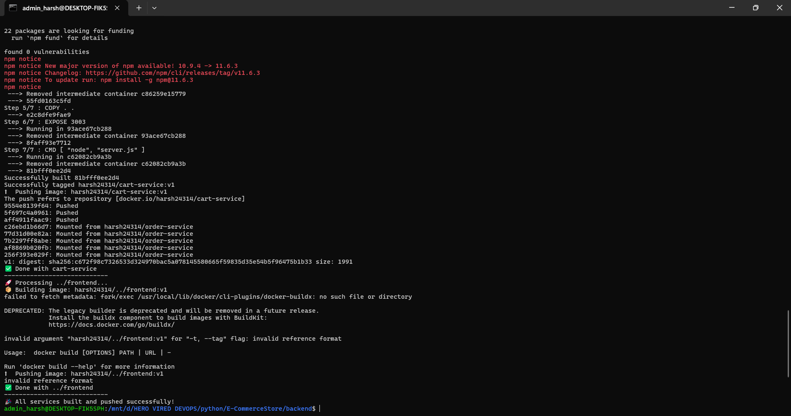

# E-Commerce Microservices Application
A full-stack MERN e-commerce application built with microservices architecture, featuring 4 separate Node.js backend services and a React frontend.

[Application documentation](application-documentaion.md)

## Provisioning infrastructure and deploying 
[x] Create `Dockerfile` file for each service    
[x] Build and push images to the `docker hub` using `shell script`   
[x] Provision required resources using `terraform`    

- Build and Push images to docker hub    
